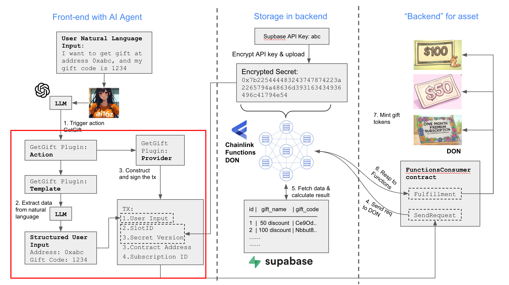
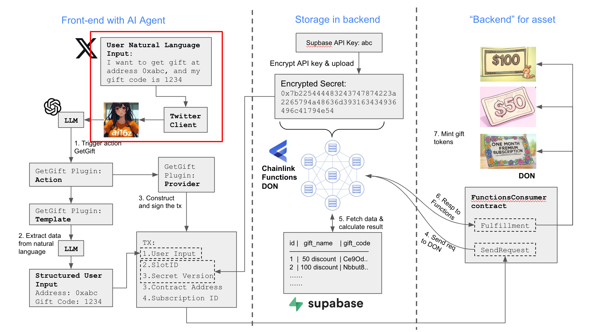

# Eliza-Chainlink-Functions




## Overview

This repository demonstrates the use of the **ElizaOS Agentic AI framework** to build an AI agent that interacts with user inputs through a terminal or Twitter interface.

The agent enables users to provide a gift code and their wallet address to mint a gift NFT on the **Sepolia Network**.

The agent integrates with [Chainlink Functions](https://docs.chain.link/chainlink-functions) through custom actions for seamless on-chain interactions.


---

## Using API Keys in Chainlink Functions

Chainlink Functions requires API keys (such as the Supabase API key) to access off-chain data securely. There are two methods to store these secrets:

1. **DON-hosted secrets**
2. **Off-chain secrets**

> **Security Note:**
> All secrets are encrypted using threshold encryption. This approach partitions the master key across multiple Decentralized Oracle Network (DON) nodes, each holding a shard. This design eliminates reliance on a centralized private key and ensures high availability and fault tolerance.

---

## Workshop Focus: Storing Secrets on the DON

In this workshop, you will upload the Supabase API key directly to the DON after encrypting it using the DON’s master key.

We utilize the `@chainlink/functions-toolkit` NPM library to assist with secure encryption and uploading of secrets.

---

## Step-by-Step Guide to Upload Secrets

### 1. Clone the Repository

```bash
git clone -b for-sepolia https://github.com/abdulsamed1/Eliza-Chainlink-Functions.git
```

Alternatively:

```bash
git clone https://github.com/abdulsamed1/Eliza-Chainlink-Functions.git
```

### 2. Install Dependencies

```bash
cd Eliza-Chainlink-Functions
pnpm install
```

### 3. Configure Environment Variables

Edit the `.env` file to add your necessary environment variables (e.g., Supabase keys).

### 4. Encrypt and Upload Your Secret

Run the script to encrypt and upload your Supabase API key to the DON:

```bash
node ./scripts/uploadToDON.js
```

On success, you will see output similar to:

```
Make request...
Upload encrypted secret to gateways https://01.functions-gateway.testnet.chain.link/, https://02.functions-gateway.testnet.chain.link/. Slot ID: 0. Expiration in minutes: 1440

✅ Secrets uploaded properly to gateways!
Gateways response: { version: 1739510832, success: true }

donHostedSecretsVersion is 1739510832, saved info to donSecretsInfo.txt
```

> **Important:** The secret expires after 24 hours. To update before expiration, simply rerun the script. The previous secret will be overwritten.

---

### 5. Update Contract Configuration

Copy the values from `donSecretsInfo.txt` and update the file at:

```
src/custom-plugins/actions/gift/config/GiftContractConfig.ts
```
---

## Running the Agent

Start the agent with:

```bash
pnpm i && pnpm build && pnpm start
```

Upon successful startup, you will see logs confirming:

* Environment initialization
* Services registration (e.g., browser, image description, text generation)
* Agent and room creation
* User creation and linkage to the agent

Example snippet from logs:

```
[ElizaLogger] Initializing with:
    isNode: true
    verbose: false
    NODE_ENV: undefined

✓ SUCCESS  
Creating runtime for character Eliza  
✓ Registering action: get gift  
...

✓ User Eliza created successfully.  
✓ Service text_generation initialized successfully  
...

◎ Chat started. Type 'exit' to quit.
```

You can interact with the agent by typing commands after the prompt:

```
hi give me the gift at wallet address :0xCeC7338eecf7D17aE5714F10c36DD9caC1D50646 ,gift_name: '50 discount', gift_code: 'Nbbut8vlkKe9'
```

---
# Result


- The AI agent will process the request and return the message and transaction hash. You will the see the info below:
```
Agent: Ah, the 50 discount saga continues with unwavering determination. Let's consult the cosmic gift registry once more to see if this code finally grants you the thrifty victory you've been chasing across the cosmos.
Agent: Gift request successful! Code: Nbbut8vlkKe9, Address: 0xCeC7338eecf7D17aE5714F10c36DD9caC1D50646
Transaction Hash: 0x2c8700e9a191207b01fb579b454ea3ede7b857bc4243f88f99da15115066cdc8
```
---
 ### Looking here  [EthScan](https://sepolia.etherscan.io/tx/0x2c8700e9a191207b01fb579b454ea3ede7b857bc4243f88f99da15115066cdc8)


 ------
 -----


 


 To allow users to interact with our Eliza Agent through a Twitter account, we create twitter client and register it with the agent (repo reference). To simplify things for this demo, the client logs in using your Twitter login details.  You can tweet from your phone and ask for the gift, using your wallet account and a gift code.  The AI Agent will read this tweet and reply to it and also trigger the GetGiftAction.

Steps to use Twitter as client
Update the Agent's character file

In the file src/character.ts Specify that twitter is the client for AI agent to use as below. 

Copy
...
clients: [Clients.TWITTER],
...
Add Twitter credentials

Update the twitter credentials in .env file as below.

```

TWITTER_DRY_RUN=false
TWITTER_USERNAME= # Account username
TWITTER_PASSWORD= # Add your account password 
TWITTER_EMAIL= # Add your account email
TWITTER_POLL_INTERVAL=30 #seconds
Start the agent again by command
```

```
pnpm start
```

Check if the twitter account is running and posted first message. If it is working properly, you will see tweet like below. There will be a tweet posted if everything works.


This tweet is posted by AI agent
Post a new tweet to ask for a gift (make sure to tag the account's username!). 

Don't reply in the same thread as your agent's tweet.

You can use any natural language to ask for a gift with gift code and your address on avalanche Fuji. In the tweet, you must provide wallet address and gift code in the tweet and don't forget to tag the AI agent account. 

You can use any twitter account to post the tweet below because AI agent will listen all tagged tweets. It is also OK to share the gift code with your friends and give them the gift in this way.


Post a new tweet to ask for a gift
Check the responses

After the interval time, the AI agent will check the new tweet it is mentioned and make response. Usually, there will be 2 responses from the AI agent. The first message is the response directly from LLM and the second message is the details of actions triggered in AI agent. 

Replied like below is generated by AI agent with LLM. the second one provides transaction hash to the user.


Responses from AI agent
Check the Chainlink Functions app

Just as what we did with direct client. A transaction is sent to the Functions consumer smart contract. Then the request is displayed on Functions.app. 


latest successful fulfillment to the request
Check if a NFT minted for a specific address 

Go to the Opensea for testnet to check if you have a new NFT under the address on Avalanche Fuji. You may have the different gifts on your address. Also don't forget gift codes cannot be used twice. 


A specific NFT is dropped to the address based on the gift ID in request