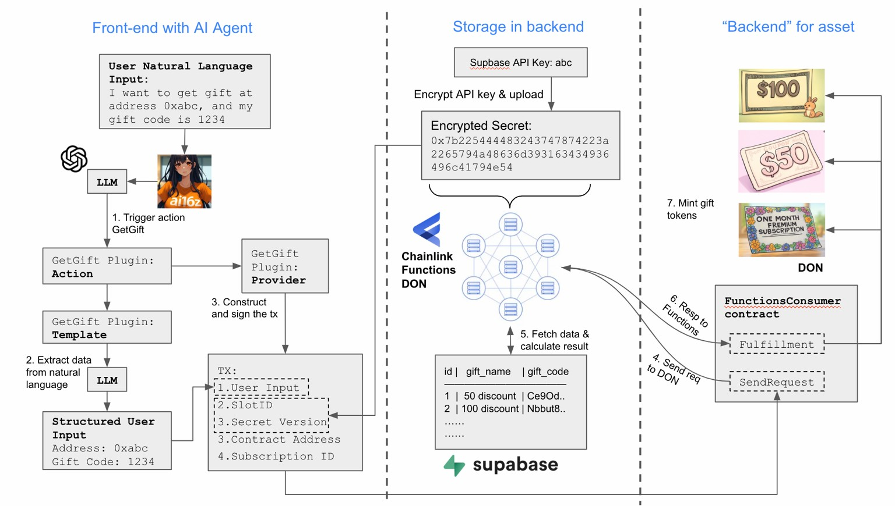

# 🎓 Project Documentation: AI-Powered NFT Gifting Agent

## 🧠 Overview
This project demonstrates a hybrid Web3/Web2 AI Agent system that allows users to receive NFTs simply by replying to a tweet. It uses:
---

## 📌 Features
- AI Agent (via Eliza) listens to Twitter for natural language NFT requests.
- Processes inputs using an LLM (e.g., GPT) to understand context.
- Checks gift code validity in Supabase.
- Triggers Chainlink Function to mint NFT on testnet.
- Sends NFT to wallet address mentioned in the tweet.

---

## 🏗️ Architecture



---

## 📦 Tech Stack
- **AI Agent**: [ElizaOS](https://github.com/eliza-ai/elizaos)
- **LLM**: OpenAI / GPT-style
- **Database**: Supabase (PostgreSQL + API)
- **Oracle Bridge**: Chainlink Functions
- **Blockchain**: Sepolia Testnet
- **Testing**: Foundry Toolkit
- **Auditing**: Slither + Cyfrinup

---

## 🚀 Setup Guide

###  Using Docker
Use the docker image. It includes our project in a single image. /home/share will be mounted to /share in the container.

```bash
docker pull ????????????????
```

###To share a directory in the container:
```bash
docker run -it -v /home/share:/share image ????????????
```

To install all dependencies:

```bash
make install
```

###  Eliza Agent Configuration
Set up your Eliza Agent with Twitter client and Supabase plugin. Define:
- Natural language pattern recognition
- Gift code verification via REST call
- Trigger to Chainlink Functions when valid

###  Chainlink Functions Setup
- Deploy your on-chain contract to Sepolia
- Set up off-chain source code for Chainlink Functions to:
  - Receive input (wallet address)
  - Trigger minting logic

---

## ✅ Use Cases
- Marketing campaigns: Reward users who engage with tweets.
- Event ticketing: Issue NFTs based on RSVP codes.
- Gaming: Claim in-game items through social media.

---

## 🛡️ Security Notes
- All gift codes are stored and verified **off-chain** for privacy.
- Smart contract uses access control to avoid abuse.
- Chainlink ensures decentralized and verifiable execution.

---

## 🔗 Links
- [Eliza GitHub](https://github.com/eliza-ai/elizaos)
- [Chainlink Functions Docs](https://docs.chain.link/functions)
- [Supabase Docs](https://supabase.com/docs)